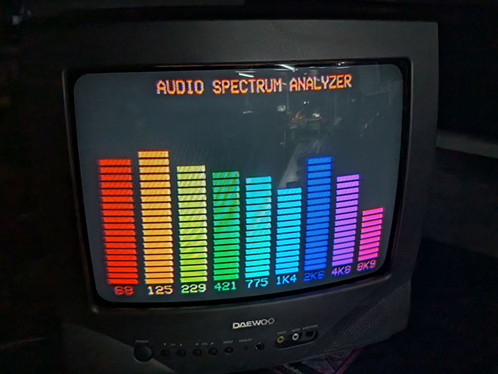
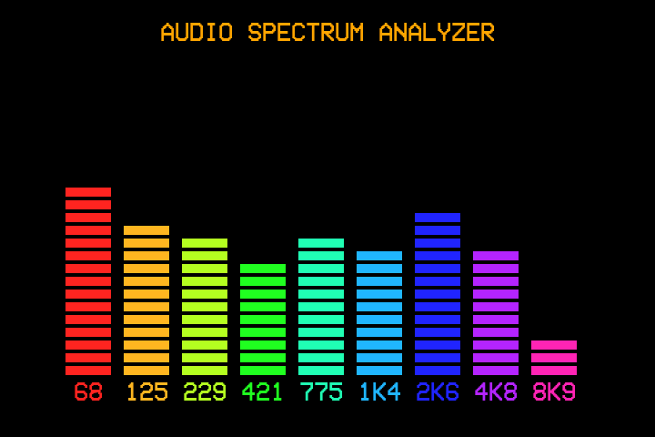

# LOUDNESS (`loudness`)

A Raspberry Pi appliance that renders a real-time LED-matrix-style audio
spectrum visualizer over composite video, driven by a USB microphone.

Built for a Raspberry Pi 3B+ running Raspberry Pi OS Bookworm, output via
the analog composite video jack to a CRT. Shares its console/framebuffer
architecture with [BARS](https://github.com/LawtonBarnes/bars) -- headless
pygame, direct `/dev/fb0` writes, raw `evdev` keyboard input.





## 9 fixed bands

Bars are centered on 9 fixed frequencies -- 125, 250, 500, 750Hz, 1K,
1.5K, 2K, 4K, 8K -- not an auto-computed log-spaced range. Each bar
covers the FFT bins between the geometric mean of its neighboring
centers, with the bottom/top bands bounded by `settings.ini`'s
`low_freq`/`high_freq`.

## Auto-gain, tilt, and per-mic calibration

Levels are computed on a dB scale, with a continuously self-adjusting
auto-gain (a peak-hold envelope tracks recent loud input and retargets
gain so it sits just under clipping) so loud and quiet rooms both stay
readable without a manual sensitivity knob. `Up`/`Down` adjust a manual
`gain_bias` on top of that, persisted live to `settings.ini`.

A fixed linear tilt (`treble_boost`/`bass_cut_db`) compensates for music
naturally carrying more bass/mid energy than treble. On top of *that*,
`band_offsets` (9 explicit per-band dB values, default all zero) exists
specifically to correct **hardware** differences between individual mic
units -- cheap USB electret capsules vary unit-to-unit above ~1kHz in a
way that isn't a straight line across bands, so a single tilt can't fix
it. See `calibration/README.md` for the full measurement methodology
(a real tone-sweep test across multiple mics) and how to derive these
values for your own hardware.

## Keyboard / remote controls

| Key | Action |
|---|---|
| `↑` / `↓` | Adjust gain bias up/down (persisted to `settings.ini`) |
| `Home` | Quit to the app menu |
| `Q` / `Esc` / `Back` | Quit to the app menu |
| `Power` | Shutdown/restart confirm dialog |

## Configuration

All visual and audio-processing parameters (mic device, bar count,
underscan, LED segment sizing, auto-gain ceiling, frequency range, EQ
tilt, per-band calibration offsets, noise gating, squelch) are tunable
in `settings.ini` **without a restart** -- values are re-read from disk
live wherever they're used. See the extensive comments in that file for
what each one does and why it exists.

## Requirements

- A USB microphone, addressed via ALSA (`device = plughw:X,Y` in
  `settings.ini` -- run `arecord -l` on the Pi to find the right card;
  USB audio card numbers are not stable across reboots/re-enumeration,
  so re-check this after any hardware change).
- `pygame`, `evdev`, `numpy` (system packages, no venv).

## Installing on a fresh Pi

1. **Install dependencies:**
   ```bash
   sudo apt-get install -y python3-pygame python3-evdev python3-numpy
   ```

2. **Copy the files:**
   ```bash
   sudo git clone https://github.com/LawtonBarnes/loudness.git /opt/loudness
   ```
   (`settings.ini` ships with sane defaults and `band_offsets` all
   zero -- a freshly-cloned install works immediately with any mic, no
   calibration required to get started.)

3. **Find your mic's ALSA device** and set it in `settings.ini`:
   ```bash
   arecord -l
   # e.g. "card 1: Device [USB PnP Sound Device]" -> device = plughw:1,0
   ```

4. **Create the launcher:**
   ```bash
   sudo tee /usr/local/bin/loudness > /dev/null << 'EOF'
   #!/bin/sh
   exec python3 /opt/loudness/loudness.py "$@"
   EOF
   sudo chmod +x /usr/local/bin/loudness /opt/loudness/loudness.py
   ```

5. **Enable composite video output** (same `vc4-fkms-v3d` requirement
   as [BARS](https://github.com/LawtonBarnes/bars) -- see that repo's
   README for the full explanation and config.txt steps; the summary is
   that Bookworm's default full-KMS driver doesn't reliably support
   composite on a Pi 3B+, so this needs the legacy FKMS overlay).

6. **Set boot to console** and optionally **auto-launch on boot** --
   same steps as BARS's README, substituting `loudness` for `bars`.

7. **Reboot** and confirm the CRT shows reactive spectrum bars against
   real sound.

If you're running this as part of a [McBrain](https://github.com/LawtonBarnes/mcbrain)
fleet instead of standalone, skip steps 4/6 -- install alongside
[STRINGS](https://github.com/LawtonBarnes/strings) and assign it from
[SCRUTE](https://github.com/LawtonBarnes/scrutinizer) instead of a
manual launcher/autologin.
